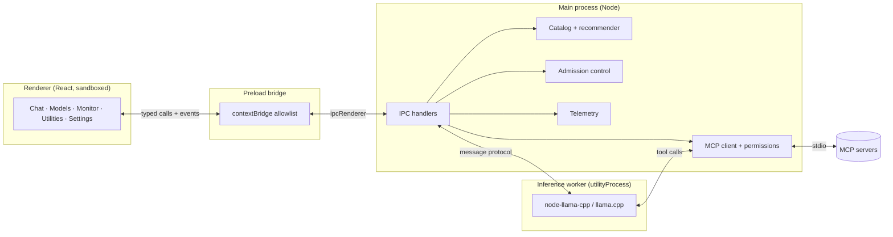

# Architecture

How PowerStation is put together, and what happens when you send a message. If you just want to
run it, start with the [Quick Start](quick-start.md); this page is for understanding the internals
and contributing.

## The shape of the app

PowerStation is an Electron app with a hard split between three trust zones:

- **Renderer** (`src/`) — the React UI. Runs with `contextIsolation`, `sandbox`, and
  `nodeIntegration: false`. It has no direct access to Node, the filesystem, or the model. It only
  sees the typed surface the preload bridge exposes.
- **Preload bridge** (`electron/preload.cjs`) — a `contextBridge` allowlist that maps a small,
  typed API (`window.powerStation.*`) onto specific IPC channels. The renderer can't invent new
  channels. The shape is mirrored in [`src/types.ts`](../src/types.ts) as `PowerStationBridge`.
- **Main process** (`electron/`) — owns everything privileged: config, the model catalogue, the
  recommender, admission control, MCP servers, telemetry, and supervision of the inference worker.
- **Inference worker** (`electron/llmWorker.ts`) — a separate `utilityProcess` where
  `node-llama-cpp` (and the native llama.cpp binary) actually runs. Crash isolation lives here: a
  native crash kills this process, not the app.

## Module map

| File | Responsibility |
| --- | --- |
| `electron/main.ts` | App lifecycle, window, the telemetry loop, memory-pressure auto-pause. |
| `electron/ipc.ts` | Every IPC handler; the seam between renderer and main. |
| `electron/llm.ts` | Main-process **host** for the worker: request/response correlation, streaming, crash recovery, model downloads. |
| `electron/llmWorker.ts` | The isolated inference process: model load, chat, tool-call handling, loop guards. |
| `electron/llmProtocol.ts` | The typed message protocol shared by host and worker. |
| `electron/admission.ts` | Pure fit math (weights + KV cache + buffers vs budget). Unit-tested. |
| `electron/hardware.ts` | Hardware detection (Apple Silicon unified memory; Windows VRAM/RAM) and memory-pressure reads. |
| `electron/catalog.ts` | Fetches/validates `catalog/models.json`; bundled offline fallback. |
| `electron/recommend.ts` | (hardware × intent) → ranked recommendations with reasons. |
| `electron/mcp.ts` | MCP client manager: connect servers, list/call tools. |
| `electron/agent.ts` | Permission-gated bridge for tool calls (MCP **and** built-in): profiles, turn grants, audit events. |
| `electron/builtinTools.ts` | First-party repair tools the model can call — same permission rails as MCP. |
| `electron/toolPreview.ts` | Human previews for side-effecting calls (file diffs, repair notes) shown at approval time. |
| `electron/skills.ts` + `skillFormat.ts` | Markdown skills: seeding, modes, trigger matching, prompt composition. |
| `electron/chats.ts` | Chat persistence: one JSON per conversation, pin/rename, project scoping, exports. |
| `electron/projects.ts` + `projectFormat.ts` | Workspaces: one JSON per project; active-project resolution. |
| `electron/customAgents.ts` + `customAgentFormat.ts` | Reusable agents: one JSON per agent; instructions + multi-folder knowledge. |
| `electron/rag.ts` + `ragUtil.ts` | Chat-with-a-folder: local embedding index per folder, retrieval with sources. |
| `electron/repair.ts` + `repairUtil.ts` | Storage scans (read-only), reclaimables, the containment guard, integrity checks. |
| `electron/backup.ts` + `backupFormat.ts` | One-file backup archive; restore through the same sanitizers as config reads. |
| `electron/apiServer.ts` + `apiFormat.ts` | Localhost OpenAI-compatible HTTP server (off by default, token-gated); pure request/response mapping. |
| `electron/admitModel.ts` | Shared fit check reused by in-app chat and the API server. |
| `electron/ollama.ts` / `electron/lmstudio.ts` | Detect models already on disk in other apps; register in place. |
| `electron/models.ts` | Indexes local GGUFs; reads header geometry; sums split parts. |
| `electron/recommend.ts` | (hardware × intent) → ranked recommendations with reasons and versus-primary rationale. |
| `electron/telemetry.ts` | Samples CPU/RAM/GPU/VRAM/storage/pressure/battery/tokens-per-sec. |
| `electron/config.ts` | Persisted state and strict sanitisation of everything on disk. |
| `src/App.tsx` | App shell, hooks, chat state, modals (permission, audit, compare, project), recovery cards. |
| `src/onboarding.tsx` | First-run scan-and-reveal flow. |
| `src/views.tsx` | Models, Monitor, Utilities, Agents, Settings, Repair. |

## What happens when you send a message

1. **Renderer** calls `chat.send({ requestId, prompt })` through the bridge.
2. **`ipc.ts` `chat:send`** gathers the selected model's info (`models.getModelInfo`, which sums any
   split GGUF parts and reads header geometry), its catalogue entry, and the current GPU budget.
3. **Admission control** (`admission.checkFit`) computes weights + KV-cache(context) + buffers
   against your usable budget. If it won't fit at any context, the turn is refused with an
   explanation. Otherwise the context is clamped to what fits, and a `chat:admission` event tells
   the UI what happened.
4. **Capability gating** resolves the model's tool tier (catalogue, or the GGUF chat template).
   Tool definitions are only attached for tool-trained models; the call budget is 15 (multi) or
   3 (single). The system prompt is composed here too — global prompt + active project's
   instructions + active skills — and the built-in repair tools register only when the Storage
   repair skill is active for this message, so their schema tokens are never spent otherwise.
5. The request crosses into the **worker**, which loads the model if needed (reusing a warm model
   and only recreating the chat session when the system prompt changes), then streams tokens back
   as `chat:token` events.
6. If the model emits a **tool call**, the worker pauses generation and asks the host to execute it.
   The host runs it through `agent.executeToolCall` → the permission model → the MCP server, and
   feeds the (untrusted, capped) result back into the model. Loop guards halt repeated identical
   calls and enforce the call budget.
7. On completion the worker returns text + tokens-per-second; the host emits `chat:done`.

If the worker crashes at any point, the host rejects in-flight calls, surfaces a **recovery card**
to the UI, and applies an escalating cooldown before it will re-spawn — so a model that crashes on
load can't be re-forked in a tight loop.

## Design decisions worth knowing

- **Bundled runtime, out of process.** PowerStation ships its own `node-llama-cpp` rather than
  depending on an external Ollama install, and runs it in a `utilityProcess` so a segfault is a
  recoverable event. (Ollama can be added later as an optional detected backend.)
- **The catalogue is data, not code.** Recommendations must stay current without app releases, so
  the model list is a remotely-fetched, validated manifest — not a hardcoded table. See
  [Models & devices](models-and-devices.md).
- **One home for each rule.** The capability tier is resolved once in the main process and handed to
  the renderer on `models:list`; the "usable for AI" budget is computed once and shared, so the
  onboarding screen and the fit summaries always quote the same number.
- **Untrusted inputs are treated as untrusted.** Remote catalogue data, model files, and MCP tool
  output are all validated/capped and never executed. See the [Threat model](../THREAT_MODEL.md).

## Related reading

- [Memory & monitoring](memory-and-monitoring.md) — the admission-control math in detail.
- [Agent harness](agent-harness.md) — MCP, permissions and gating.
- [Setup Guide](setup.md) — building and packaging.
